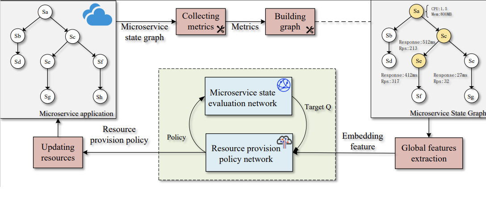

# TARP: A Topology-Aware Resource Provisioning System for Microservices

This project is a microservice resource provision system based on graph neural networks and deep reinforcement reinforcement learning. 

----

TARP propose a global feature extraction approach for microservices based on EGAT. Compared with current approaches that solely focus on extracting the resource requirements patterns of individual microservices, our proposed approach harnesses the causal inference capabilities of GNN to discern the correlations between microservices. By passing the features along the edges of the topology, our approach can extract correlations of microservices, which enables it to achieve transferability and global optimization. The architecture of TARP is as follow：

----

This project is developed based on the following programming languages and frameworks：

|language framework|version|
|---|---|
|Kubernetes|1.20.2|
|Istio|1.13.0|
|Golang|1.18.3|
|Docker|1.24.2|
|grpc|1.40.0|
|Python|3.8.0|
|Pytorch|1.10.2|
|Prometheus|2.33.3|
|Grafana|8.4.1|
|DGL|0.9.0|
